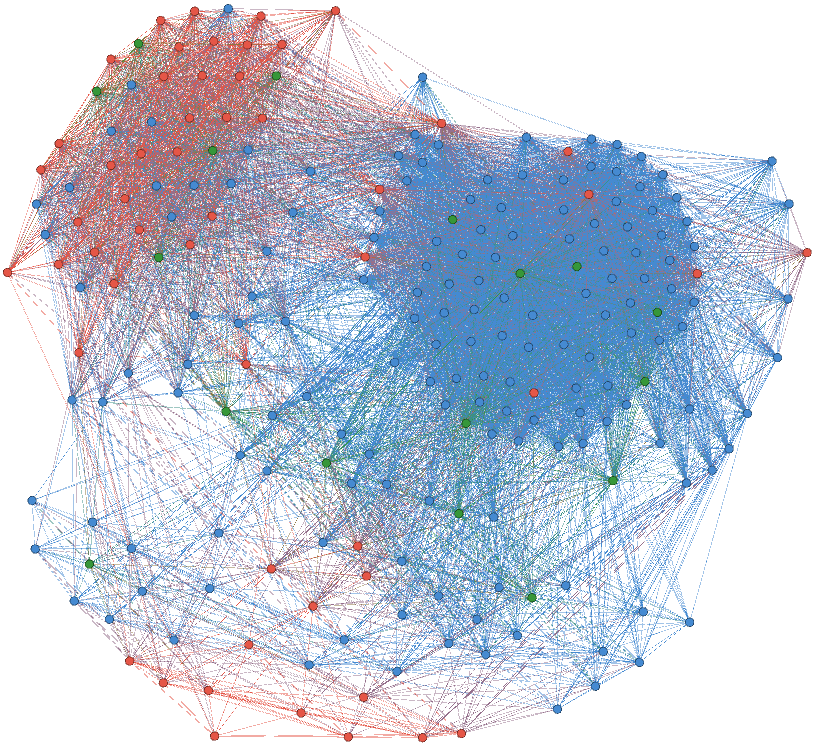

## Computational social scientist studying political communication

### Welcome

I am a doctoral student and research assistant at the [Institute of Communication and Media Studies](https://www.ikmb.unibe.ch/index_eng.html) at the [University of Bern](https://www.unibe.ch/index_eng.html). I hold a master's degree in geography from the University of Bern.

My research interests include political online communication, communication on climate change, transnational discourses and computational methods for content and network analysis.

Jump to [Research](#research) \| [Teaching](#teaching) \| [Publications](#publications) \| [Contact](#contact)

<small>How climate change is debated on the Web: Nodes represent actors, ties represent common motifs, color represents position on climate change (Häussler & Reber, work in progress).</small>

### Research

In my dissertation **"World Wide Web? A closer look at the transnationality of the public discourse about climate change on the Web,"** I examine whether the climate change issue produces transnationalized publics in different countries and search for factors that can explain the patterns found. The project aims to improve the understanding of how political discourses work in the digital society and to provide answers to current methodological challenges when it comes to the analysis of online discourses.

The dissertation is part of the project <a href="https://www.ikmb.unibe.ch/research/researchprojects/current_research_projects/current_research_projects/political_agenda_building_under_the_conditions_of_a_hybrid_media_system__a_comparison_across_countries_and_issues_2014_2017/index_eng.html" target="_blank">"Political agenda-building under the conditions of a hybrid media system – a comparison across countries and issues"</a> financed by the Swiss National Science Foundation (SNF) and the German Research Foundation (DFG).

I am member of the <a href="https://sgkm.ch/en/" target="_blank">Swiss Association of Communication and Media Research (SACM)</a>, the <a href="https://www.icahdq.org/" target="_blank">International Communication Association (ICA)</a>, and the <a href="https://ecpr.eu" target="_blank">European Consortium for Political Research (ECPR)</a>.

### Teaching

I teach courses in the areas of political communication and computational methods. My most recent teaching activities include:

* Text as Data: Introduction to Web Scraping and Text Mining mit R (bachelor proseminar, spring 2020)
* Introduction to R for communication research (bachelor tutorial, fall 2019, together with Dr. Thomas Häussler and Aleksandra Urman)
* Introduction to Web scraping and automated content analysis with R (bachelor proseminar, spring 2019)
* Structure and content: Combining social network analysis and topic modeling (PhD/postdoc workshop at the University of Bremen, fall 2018)
* Political online communication (bachelor proseminar, fall 2018)
* Introduction to communication and media studies (bachelor tutorial, fall 2018, together with Dr. Franzisca Schmidt)

### Publications

Schmid-Petri, H., Reber, U., Arlt, D., Elgesem, D., Adam, S., & Häussler, T. (2020). A dynamic perspective on publics and counterpublics: The role of the blogosphere in pushing the issue of climate change during the 2016 US presidential campaign. _Environmental Communication, 14_(3), 378-390. doi: <a href="https://doi.org/10.1080/17524032.2019.1677738" target="_blank">10.1080/17524032.2019.1677738</a> 
\[Manuscript on <a href="https://boris.unibe.ch/135097" target="_blank">BORIS</a> open repository\]

Adam, S.\*, Häussler, T.\*, Schmid-Petri, H., & Reber, U. (2019). Coalitions and counter-coalitions in online contestation: An analysis of the German and British climate change debate. _New Media & Society, 21_(11-12), 2671-2690. doi: <a href="https://doi.org/10.1177/1461444819855966" target="_blank">10.1177/1461444819855966</a> 
\[\*Shared first authorship, manuscript on <a href="https://boris.unibe.ch/133189/" target="_blank">BORIS</a> open repository\]

Reber, U. (2019). Overcoming language barriers: Assessing the potential of machine translation and topic modeling for the comparative analysis of multilingual text corpora. _Communication Methods and Measures, 13_(2), 102-125. doi: <a href="https://doi.org/10.1080/19312458.2018.1555798" target="_blank">10.1080/19312458.2018.1555798</a> 
\[Manuscript on <a href="https://boris.unibe.ch/131398/" target="_blank">BORIS</a> open repository, R code on <a href="https://github.com/ureber/mt-paper" target="_blank">GitHub</a>\]

Schmid-Petri, H., Adam, S., Reber, U., Häussler, T., Maier, D., Miltner, P., Pfetsch, B., & Waldherr, A. (2018). Homophily and prestige: An assessment of their relative strenght to explain link formation in the online climate change debate. _Social Networks, 55_, 47-54. doi: <a href="https://doi.org/10.1016/j.socnet.2018.05.001" target="_blank">10.1016/j.socnet.2018.05.001</a> 
\[Manuscript on <a href="https://boris.unibe.ch/116636/" target="_blank">BORIS</a> open repository\]

Maier, D., Waldherr, A., Miltner, P., Wiedemann, G., Niekler, A., Keinert, A., Pfetsch, B., Heyer, G., Reber, U., Häussler, T., Schmid-Petri, H., & Adam, S. (2018). Applying LDA topic modeling in communication research: Toward a valid and reliable methodology. _Communication Methods and Measures, 12_(2-3), 93-118. doi: <a href="https://doi.org/10.1080/19312458.2018.1430754" target="_blank">10.1080/19312458.2018.1430754</a> 
\[Manuscript on <a href="https://boris.unibe.ch/112835/" target="_blank">BORIS</a> open repository\]

Häussler, T., Adam, S., Schmid-Petri, H., & Reber, U. (2017). How political conflict shapes online spaces. A comparison of climate change hyperlink networks in the U.S. and Germany. _International Journal of Communication 11_, 3096–3117. <a href="https://ijoc.org/index.php/ijoc/article/view/5644" target="_blank">https://ijoc.org/index.php/ijoc/article/view/5644</a> 
\[open access\]

Häussler, T., Schmid-Petri, H., Adam, S., Reber, U., & Arlt, D. (2016). The climate of debate: How institutional factors shape legislative discourses on climate change. _Studies in Communication Sciences 16_, 94-102. doi: <a href="https://doi.org/10.1016/j.scoms.2016.04.002" target="_blank">10.1016/j.scoms.2016.04.002</a> 
\[Manuscript on <a href="https://boris.unibe.ch/112839/" target="_blank">BORIS</a> open repository\]

Adam, S., Häussler, T., Schmid-Petri, H., & Reber, U. (2016). Identifying and Analyzing Hyperlink Issue Networks. In G. Vowe & P. Henn (Eds.), _Political Communication in the Online World: Theoretical Approaches and Research Designs_ (pp. 233–247). New York, London: Routledge.

### Contact

#### online

<a href="mailto:ueli.reber@ikmb.unibe.ch"><i class="fa fa-envelope-square fa-3x"></i></a>&nbsp;&nbsp;
<a href="https://github.com/ureber" target="_blank"><i class="fa fa-github-square fa-3x"></i></a>&nbsp;&nbsp;
<a href="https://www.linkedin.com/in/ureber" target="_blank"><i class="fa fa-linkedin-square fa-3x"></i></a>

#### offline 

Universität Bern 
Institut für Kommunikations- und Medienwissenschaft 
Fabrikstrasse 8 
3012 Bern 
Switzerland

<cred>© 2020 Ueli Reber. Design by <a href="https://jekyllrb.com/" target="_blank">Jekyll</a> and <a href="https://github.com/adueck/good-clean-read" target="_blank">Good Clean Read</a></cred>
